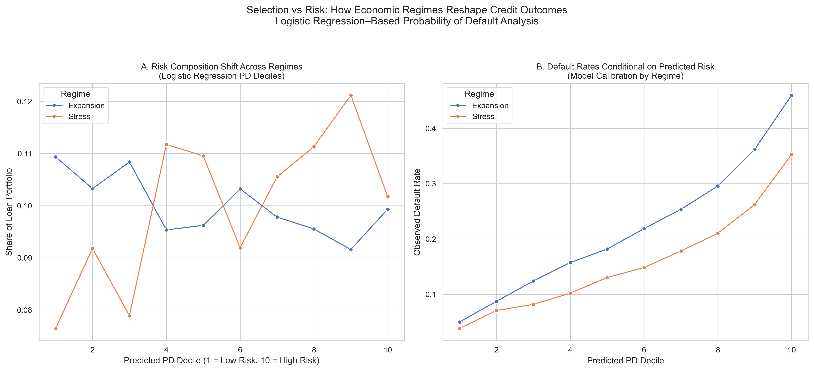
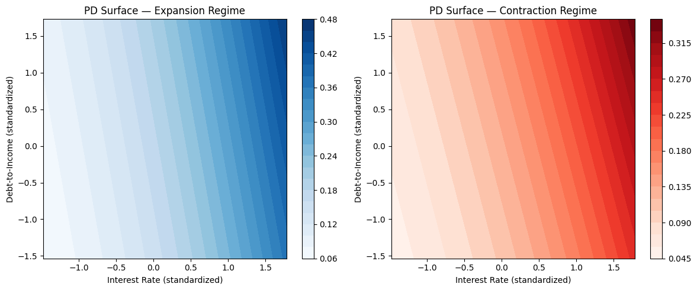
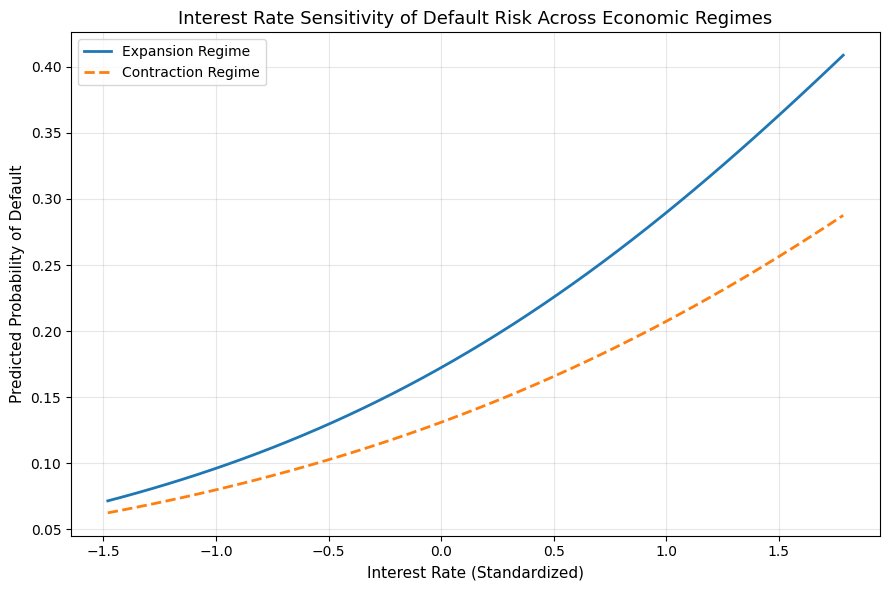
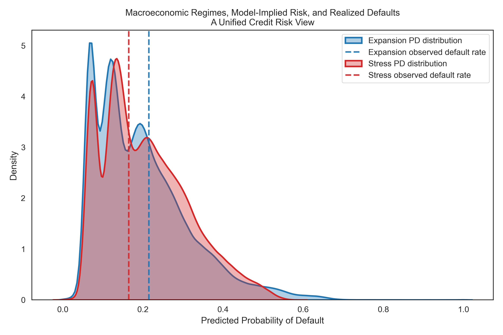

# Credit Risk Modeling Across Macroeconomic Regimes  
**A Regime-Dependent Probability of Default Analysis**

---

## Overview

This project studies how **macroeconomic regimes** reshape credit risk beyond simple changes in average default rates.  
Rather than treating credit risk as static, the analysis focuses on **structural differences** in how borrower characteristics translate into default risk across economic conditions.

Using a **logistic regression Probability of Default (PD) model** and unemployment-based regime classification, the project examines:
- How the **composition of risk** in the loan portfolio changes across regimes
- How **model-implied risk maps to realized defaults**
- How key drivers such as **interest rates and leverage** exhibit **regime-dependent sensitivities**

The emphasis is on **interpretability, economic reasoning, and empirical validation**, closely aligned with real-world credit risk and stress-testing practices.

---

## 1. Research Question

Traditional credit risk models implicitly assume that the relationship between borrower characteristics and default risk is **stable over time**.

This project asks a more realistic question:

> **Do macroeconomic regimes fundamentally reshape credit risk — not just in level, but in structure?**

Specifically:
- Does the **distribution of borrower risk** in the loan portfolio change across regimes?
- Does the **relationship between predicted PD and realized default** remain stable?
- Do key risk drivers (e.g., interest rates, leverage) behave differently under economic stress?

Answering these questions is critical for:
- Stress testing
- Model validation
- Capital planning
- Risk-based pricing

---

## 2. Methodology

### Data
- Loan-level data including borrower characteristics, loan terms, and default outcomes
- Macroeconomic data from FRED (unemployment rate)
- Sample period aligned with the post-2007 credit cycle

### Regime Definition
Macroeconomic regimes are defined using the unemployment rate:
- **Expansion regime:** unemployment below a threshold
- **Stress / contraction regime:** unemployment above the threshold

This approach provides an **externally observable, economically interpretable regime signal**, avoiding latent regime overfitting.

### Model
- **Logistic Regression** for Probability of Default (PD)
- Features include:
  - Interest rate
  - Debt-to-income ratio
  - Loan characteristics
  - Credit grades

The model is trained once.  
The analysis focuses on **how the same model behaves across regimes**, rather than refitting separate models or maximizing predictive accuracy.

---

## 3. Evidence & Findings

Each figure below corresponds to **one explicit empirical claim** about regime-dependent credit risk behavior.

---

### **Figure 1 — Selection vs Risk Across Regimes (Hero Figure)**

**Claim:**  
**Macroeconomic regimes reshape credit risk even after conditioning on predicted PD.**

**Detailed explanation:**  
This two-panel figure decomposes credit risk into **portfolio composition effects** and **conditional default behavior**, using predicted PD deciles from the logistic regression model.

- **Panel A (Risk Composition):**  
  Loans are grouped into PD deciles based on model-predicted risk.  
  The figure shows that during stress regimes, the observed loan portfolio becomes more concentrated in higher PD deciles.  
  This reflects **selection effects**: underwriting standards and borrower participation change under economic stress.

- **Panel B (Conditional Default Rates):**  
  Holding predicted PD constant, observed default rates differ across regimes.  
  This indicates **regime-dependent calibration drift**, where identical risk scores correspond to different realized outcomes depending on macroeconomic conditions.

Together, these panels demonstrate that **credit risk is endogenous to the economic regime**, even when the underlying PD model is unchanged.



---

### **Figure 2 — Structural Sensitivity of Default Risk (PD Surface)**

**Claim:**  
**The structural mapping from borrower characteristics to default risk changes across regimes.**

**Detailed explanation:**  
This figure visualizes predicted PD as a **nonlinear surface** over interest rate and debt-to-income ratio, derived from the logistic regression model.

- Each surface represents \( P(\text{Default} \mid X, \text{Regime}) \)
- Comparing expansion and contraction regimes reveals differences in:
  - Slope (marginal risk sensitivity)
  - Curvature (interaction effects)
  - Overall risk geometry

Rather than simply shifting risk upward, economic stress **reshapes how borrower characteristics translate into default probability**.  
This highlights that coefficients alone are insufficient to understand regime-dependent risk behavior.



---

### **Figure 3 — Interest Rate Sensitivity Across Regimes**

**Claim:**  
**Interest rate risk is amplified during economic stress.**

**Detailed explanation:**  
This figure isolates the marginal effect of interest rates on predicted PD while holding other borrower characteristics fixed.

- Under contraction regimes, PD increases more steeply with interest rates
- Under expansion regimes, the same rate increase has a weaker effect

This demonstrates **regime-dependent sensitivity**, where pricing and refinancing risk becomes more pronounced during stress periods.  
Such behavior is consistent with tightening financial conditions and reduced borrower resilience.



---

### **Figure 4 — Model-Implied Risk vs Realized Defaults**

**Claim:**  
**Macroeconomic regimes shift both predicted risk distributions and observed outcomes.**

**Detailed explanation:**  
This figure compares the distribution of model-predicted PDs with observed default rates across regimes.

- Stress regimes exhibit right-shifted PD distributions
- Observed default rates align with the relative ordering implied by the model

The figure confirms that:
- The model remains **rank-order consistent**
- Absolute risk levels are **scaled by macroeconomic conditions**

This supports the use of regime-aware interpretation without discarding the underlying PD model.



---

## 4. Key Takeaways

- Credit risk is **regime-dependent**, not regime-invariant
- Portfolio selection, sensitivity, and calibration all shift across economic cycles
- Logistic regression remains effective when paired with:
  - Regime conditioning
  - Structural visualization
  - Economic interpretation

---

## Stress Testing Philosophy

Stress testing in this project is implemented **structurally**, rather than via a standalone scenario engine.

Stress effects are captured through:
- Macroeconomic regime conditioning
- Regime-dependent PD surfaces
- Sensitivity and calibration analysis

This mirrors industry practice, where the same model is evaluated across economic states rather than replaced.

---

## Reproducibility

All figures and results in this repository can be reproduced by:
1. Installing dependencies listed in `requirements.txt`
2. Running the scripts in the `src/` directory

The project is designed to be **fully reproducible and modular**.

---

## Repository Structure

## Repository Structure

```text
credit-risk-economic-regimes/
├── notebooks/
│   └── Exploratory analysis and feature engineering
├── reports/
│   └── figures/
│       └── Final figures used in the analysis
├── src/
│   └── End-to-end modeling, regime definition, and reporting pipeline
├── PROJECT_DECISIONS.md
│   └── Modeling rationale, assumptions, and design choices
├── README.md
│   └── Project overview, methodology, figures, and findings
├── requirements.txt
│   └── Python dependencies


---

## Limitations

- The PD model does not explicitly include macroeconomic variables;  
  regime effects are analyzed via conditioning rather than direct inputs
- Results reflect **structural risk behavior**, not regulatory capital estimates
- Interpretability is prioritized over maximum predictive accuracy

---

## Skills & Concepts Demonstrated

This project demonstrates applied skills and concepts commonly expected in
quantitative risk, credit analytics, and applied data science roles.

### Modeling & Statistics
- Logistic regression for probability of default (PD)
- Conditional probability modeling
- Regime-dependent risk analysis
- Model calibration and validation concepts
- Sensitivity analysis and marginal effects

### Machine Learning & Data Science
- Feature engineering
- Train/test splits with temporal structure
- Model interpretability over black-box optimization
- Distributional analysis and visualization
- Counterfactual reasoning

### Financial Risk & Economics
- Credit risk modeling
- Macroeconomic regime classification
- Stress-testing intuition
- Portfolio selection effects
- Economic interpretation of model outputs

### Tools & Stack
- Python
- pandas, NumPy
- scikit-learn
- matplotlib / seaborn
- Git & GitHub

---

## Relevant Coursework & Certifications

- Probability & Statistics for Data Science
- Machine Learning Foundations
- Financial Risk Management (FRM-aligned concepts)
- Applied Econometrics / Time Series Analysis


---

## Extensions

Potential future extensions include:
- Regime-aware model recalibration
- Counterfactual macro stress scenarios
- Time-varying coefficient models
- Capital allocation applications
